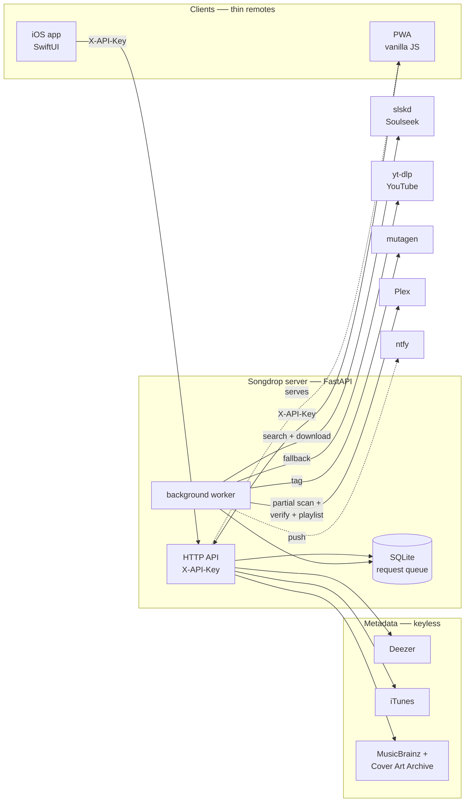

# Songdrop architecture

Songdrop is a **song-first request system** for a self-hosted music library: search a
track on your phone or the web, and your own server acquires it (Soulseek via slskd,
with a YouTube/yt-dlp fallback), tags it, files it into Plex, optionally adds it to a
playlist, and pushes a notification. The clients are thin remotes — all the real work,
credentials, and content live on a server the user runs.

This directory documents how it's built. Start here, then follow the links.

## The pieces

| Doc | Covers |
| --- | --- |
| [server.md](server.md) | FastAPI app: HTTP API, config, SQLite queue, auth, startup |
| [pipeline.md](pipeline.md) | The acquisition pipeline: worker, scoring, slskd, yt-dlp, tagging, Plex import |
| [frontends.md](frontends.md) | The iOS (SwiftUI) app and the PWA — two thin clients over the same API |
| [deployment.md](deployment.md) | Build/ship/run: Docker image, TrueNAS, Cloudflare Pages, TestFlight, secrets |

## System diagram



## Request lifecycle

Every request is a row in the SQLite `requests` table, drained one at a time by the
background worker:

```
queued → searching → downloading → tagging → importing → done
             │                                              
             └──────────────→ waiting  (nothing found; retried every
                                         RETRY_INTERVAL until found or deleted)
  any state ──────────────→ failed   (error recorded)
```

Two modes: `acquire` (the default — search + download via slskd/YouTube) and `import`
(tag a file already on disk). Source preference for `acquire`: an explicit
`youtube_url` wins, then Soulseek's best-scored candidate, then the YouTube fallback.
The final `done` detail is **honest** — it says "ready to play" only when the track is
verified present in Plex, otherwise it explains that the file is on disk but Plex
hasn't indexed it (usually a `/music` volume / `PLEX_LIBRARY_DIR` mismatch).

## Technology at a glance

- **Server:** Python 3.12, FastAPI + uvicorn, `httpx` (async), `mutagen` (tagging),
  `yt-dlp`; SQLite queue guarded by a `threading.Lock`; a single asyncio worker. The
  PWA is served from the same app at `/`.
- **Acquisition:** slskd REST API (Soulseek) with format/peer scoring; yt-dlp fallback
  with duration-hint scoring; metadata from Deezer + iTunes (search) and MusicBrainz +
  Cover Art Archive (album tracklists).
- **iOS:** SwiftUI (iOS 17+), generated from `project.yml` via XcodeGen.
- **PWA:** vanilla JS/CSS, no build step, installable, offline shell (never caches the API).
- **Delivery:** multi-arch Docker image (`jamesacklin/songdrop`), TrueNAS SCALE custom
  app, marketing site on Cloudflare Pages (`songdrop.ackl.in`), iOS via TestFlight.

## Configuration model

Config comes from environment variables at container start; a subset (slskd/Plex
settings + `ytdlp_enabled`, the `RUNTIME_KEYS`) can be changed at runtime via
`PUT /api/config`, persisted in the DB and applied without a restart. Paths and the
access key stay env-only. The access key (`SONGDROP_API_KEY`) auto-generates on first
boot if unset and is printed to the logs. See [server.md](server.md) for the full list.
